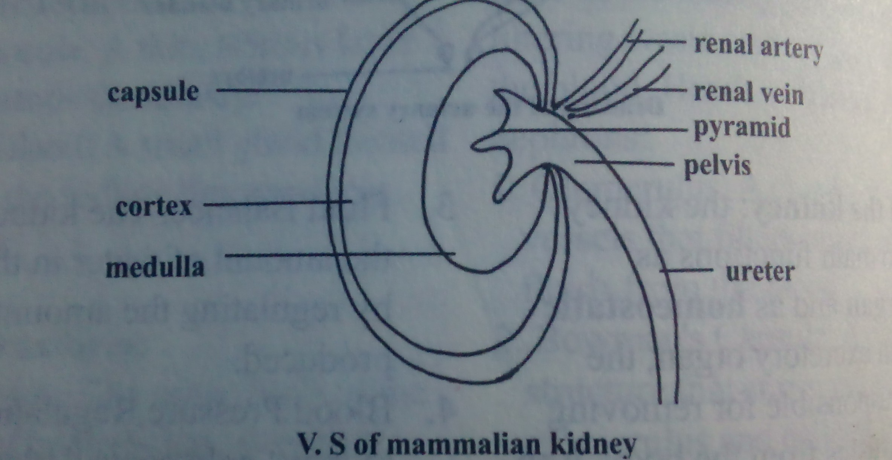
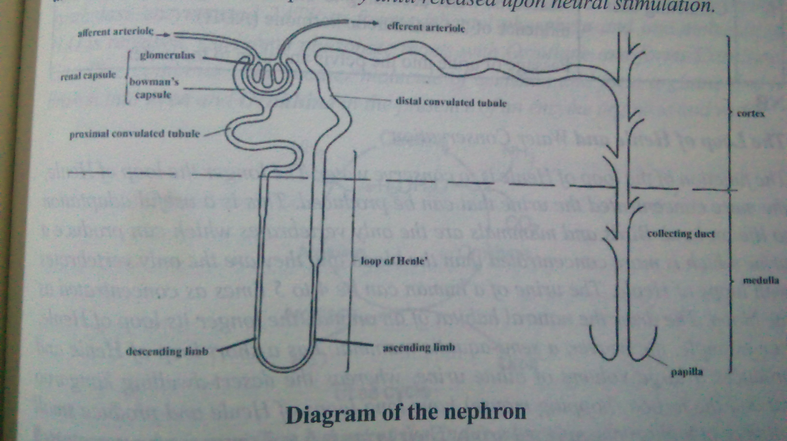
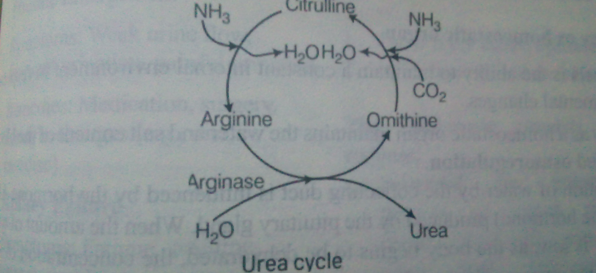
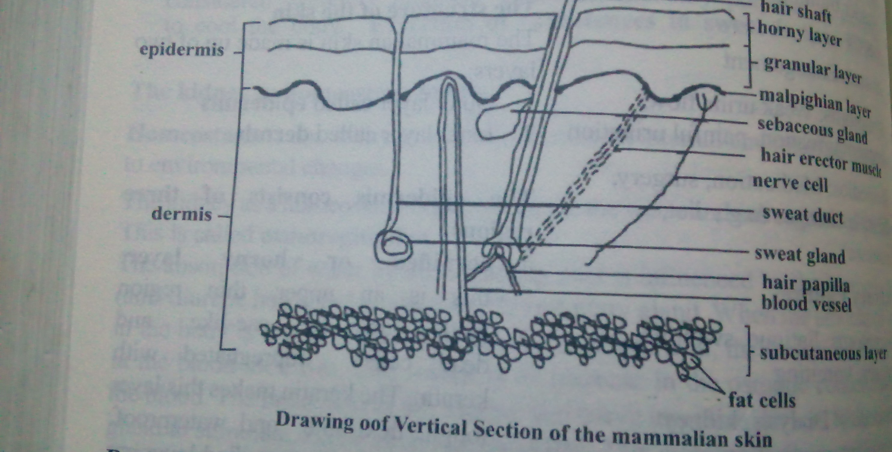
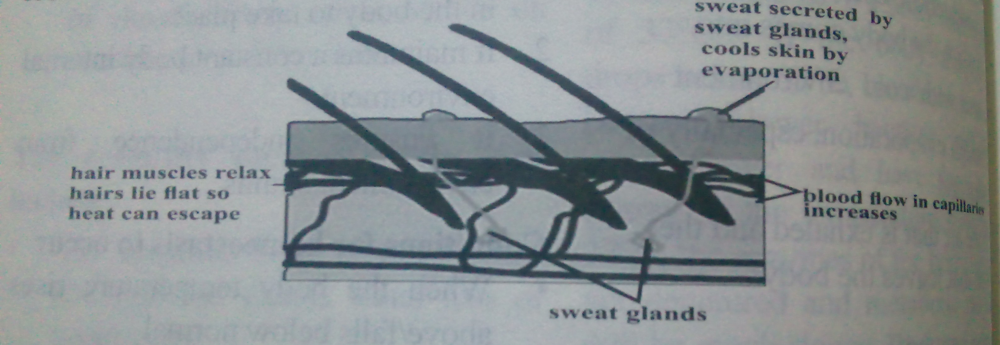
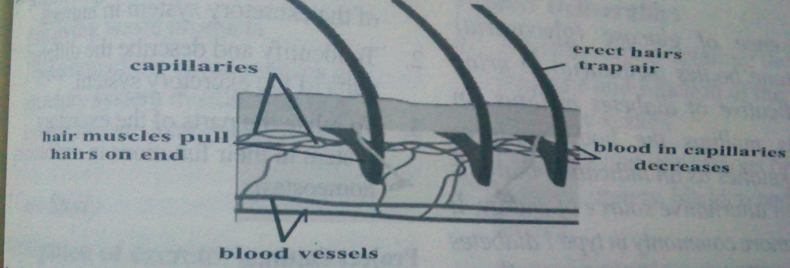

# The Excretory System of Humans And Relate The Parts to Their Functions in Homeostasis

## Learning Indicators:

Excretion is any process by which an organism or a cell gets rid of the waste products of its metabolism. The main waste products produced by mammals are carbon dioxide, water and nitrogenous substances. They are excreted via the lungs, skin or urinary system.

The term **excretion**, **secretion** and **egestion** all describe the passing out of substances by organisms or cells. **Secretion** is the production of useful substances such as enzymes and hormones by metabolic process. **Egestion** is the removal of solid undigested substances in food through the anus e.g. faeces.

## Functions of the Excretory System

1. Waste Removal: Eliminates waste products from the body.
2. Fluid Balance: Regulates the amount of fluids in the body.
3. Electrolyte Balance: Maintains the balance of electrolytes (such as sodium, potassium, and calcium) in the body.
4. pH Balance: Maintains the body's acid-base balance.
5. Detoxification: Removes toxins and waste products from the body.

## Processes of the Excretory System

1. Filtration: The kidneys filter waste and excess fluids from the blood.
2. Reabsorption: The kidneys reabsorb essential nutrients and fluids back into the bloodstream.
3. Secretion: The kidneys secrete waste products into the urine.
4. Excretion: The urine is eliminated from the body through the urethra.

## Excretory organs

These are organs or systems responsible for the removal of toxic waste substances.

Mammals have four main excretory organs namely lungs, kidneys, liver and the skin. The excretory organs and the excretory products they remove are:

| SN | Organ | Associated excretory product |
|----|-------|------------------------------|
| 1 | Lungs | Carbon dioxide and water |
| 2 | Kidneys | Water and urea |
| 3 | Liver | Bile pigment and urea |
| 4 | Skin | Mineral salts, water and traces of urea |

## The urinary system

The urinary system in the body creates, stores and transports urine. It consists of the kidneys, ureters, bladder and urethra.

A kidney is a bean-shaped organ about 11cm long. We have two kidneys positioned near the middle of the back, just below the ribcage. All blood in the body flows through the kidneys every minutes, so your body is filtered for toxins 150 times a day.

## Kidney structure

The kidney is a complex organ with several distinct structures that work together to filter waste and excess fluids from the blood. Here's an overview of the kidney structure:

### External Structures:

1. Renal Capsule: A thin, fibrous layer that surrounds the kidney.
2. Adrenal Gland: A small gland located on top of the kidney that produces hormones.

### Internal Structures:

1. Renal Cortex: The outer layer of the kidney that contains the glomeruli and proximal convoluted tubules.
2. Renal Medulla: The inner layer of the kidney that contains the loops of Henle and collecting ducts.
3. Glomeruli: Tiny clusters of blood vessels that filter waste and excess fluids from the blood.
4. Proximal Convoluted Tubules: Coiled tubes that reabsorb nutrients and water from the filtrate.
5. Loops of Henle: U-shaped tubes that help regulate electrolyte balance and water reabsorption.
6. Distal Convoluted Tubules: Coiled tubes that reabsorb electrolytes and water from the filtrate.
7. Collecting Ducts: Tubes that collect urine from the nephrons and transport it to the renal pelvis.

### Blood Supply:

1. Renal Artery: The main artery that supplies blood to the kidney.
2. Renal Vein: The main vein that carries blood away from the kidney.

### Nephrons:

Nephrons are the functional units of the kidney, responsible for filtering waste and excess fluids from the blood. Here's a detailed overview of nephrons:

1. Glomerulus: A cluster of tiny blood vessels that filters waste and excess fluids from the blood.
2. Bowman's Capsule: A cup-like structure that surrounds the glomerulus and collects the filtrate.
3. Proximal Convoluted Tubule (PCT): A coiled tube that reabsorbs nutrients, water, and electrolytes from the filtrate.
4. Loop of Henle: A U-shaped tube that helps regulate electrolyte balance and water reabsorption.
5. Distal Convoluted Tubule (DCT): A coiled tube that reabsorbs electrolytes and water from the filtrate.
6. Collecting Duct: A tube that collects urine from multiple nephrons and transports it to the renal pelvis.

### Drawing of the urinary system

## Function of the kidney:

The kidney carry out two main functions as excretory organ and as homeostatic organs. As an excretory organ, the kidneys are responsible for removing nitrogenous wastes from the body. And also as homeostatic organ it regulates the osmotic pressure of the blood by controlling the excretion of water and salts. The functions of the kidney include:

1. Waste Removal: The kidneys filter waste products, such as urea, creatinine, and other toxins, from the blood and excrete them in the urine.
2. Electrolyte Balance: The kidneys regulate the levels of essential electrolytes, such as sodium, potassium, and calcium, in the body.
3. Fluid Balance: The kidneys adjust the amount of water in the body by regulating the amount of urine produced.
4. Blood Pressure Regulation: The kidneys help control blood pressure by adjusting the amount of fluid in the body and producing hormones that help regulate blood pressure.
5. Red Blood Cell Production: The kidneys produce erythropoietin, a hormone that stimulates the production of red blood cells.
6. Vitamin D Activation: The kidneys convert vitamin D into its active form, which is necessary for bone health.
7. Acid-Base Balance: The kidneys help maintain the body's acid-base balance by regulating the excretion of hydrogen ions.
8. Hormone Regulation: The kidneys produce hormones that help regulate various bodily functions, such as blood pressure, electrolyte balance, and red blood cell production.

**Renal pelvis:** the renal pelvis is a funnel-shaped cavity which connects the medulla to the ureter. Its function is to collects urine from the tubules in the medulla and passes it into the ureter.

**Ureter:** is the tubes which connect the kidneys to the bladder. Its main function is to take urine from the kidney to the bladder.

**Urethra:** urine is discharge out of the body through the urethra.

**Bladder:** Sometimes called the urinary bladder is a sac-like organ in the pelvic cavity. It is a reservoir (storage place) for urine.

### V.S of mammalian kidney

## Structure of the urinary tubules

The urinary tubules, also known as the nephrons, are the functional units of the kidney. Each nephron consists of a series of tubules that work together to filter waste and excess fluids from the blood. Here's an overview of the structure of the urinary tubules:

1. **Proximal Convoluted Tubule (PCT):** The PCT is the first part of the nephron and is responsible for reabsorbing nutrients, water, and electrolytes from the filtrate.
2. **Proximal Straight Tubule (PST):** The PST is a continuation of the PCT and is also involved in reabsorption.
3. **Loop of Henle:** The Loop of Henle is a U-shaped tubule that helps regulate electrolyte balance and water reabsorption. It consists of a descending limb and an ascending limb.
4. **Distal Convoluted Tubule (DCT):** The DCT is responsible for reabsorbing electrolytes and water from the filtrate.
5. **Collecting Duct:** The collecting duct is the final part of the nephron and is responsible for collecting urine from multiple nephrons and transporting it to the renal pelvis.

## Specialized Structures:

1. **Brush Border:** The brush border is a specialized structure found in the PCT and PST that helps increase the surface area for reabsorption.
2. **Microvilli:** Microvilli are small, finger-like projections found in the PCT and PST that help increase the surface area for reabsorption.
3. **Tight Junctions:** Tight junctions are specialized structures found between the cells of the urinary tubules that help regulate the passage of ions and water.

### Functions:

1. Filtration: The urinary tubules filter waste and excess fluids from the blood.
2. Reabsorption: The urinary tubules reabsorb nutrients, water, and electrolytes from the filtrate.
3. Secretion: The urinary tubules secrete waste products and excess electrolytes into the urine.
4. Excretion: The urinary tubules excrete urine into the renal pelvis.

## Formation of urine

The formation of urine is a complex process that involves the kidneys, nephrons, and various physiological mechanisms. Here's a step-by-step explanation of how urine is formed:

Ultrafiltration is the filtration of fluid from the blood in the Bowman's capsule under pressure. This occurs between the capillaries in the glomerulus and the Bowman's capsule. Blood enter the kidney through the **afferent arteriole** and leaves through the **efferent arteriole**. The efferent arteriole of the glomerulus is narrower than the afferent arteriole. This creates high pressure in the glomerulus, causing certain substances to filter through the thin layers of cell separating the cavity of the capsule from the capillaries. The filtration results in the passage of all small molecules out of the plasma into the cavity of the capsule. Materials filtered include small food molecules (e.g. amino acid and glucose), mineral salts, vitamins, hormones and waste s such as urea and uric acid.

The second step involves selective reabsorption back into the blood of the useful metabolites (glucose, amino acid) from the glomerular filtrate (filtrate in the tubule). This happens as the filtrate passes along the first convoluted tubule by **passive diffusion** and **active transport**. The microvilli of the cells lining the lumen of the tubule provide a large surface area which aids reabsorption. Water is also reabsorbed by **osmosis**.

The concentrated filtrate now passes into the loop of Henle and the second convoluted tubule in which reabsorption of salts and water is regulated. If the blood has a lower water content than required, through excessive sweating for instance, the equilibrium may be restored by the tubule absorbing water.

**Tubular secretion** is a process by which substances are removed from blood and added to the tubular fluid.

The loop of Henle has a thin descending limb, a thick ascending limb and a thin ascending limb. The fluid entering the descending limb contains sodium chloride and other salts, urea and other chemicals that have been filtered out from the blood. The cells here are permeable to water and thus the salt and urea concentration rises within the fluid by the time it reaches the bend. The ascending limb is permeable to sodium chloride, which passes out of the tubule into the medullary tissue surrounding it. Because the two sides of loop of Henle perform opposing functions, it acts as a **countercurrent multiplier**. Thus they absorb water on the one hand and solute on the other.

The distal convoluted tubule, is a duct of the renal tubule located in the kidney's cortex that reabsorbs calcium, sodium, and chloride and regulates the pH of urine by secreting protons and absorbing bicarbonates. The pH of human blood is neutral, between pH 7.35 to 7.45. Anything above/below this range is dangerous to the body. When the body fluid/blood becomes acidic; the cells of the distal convoluted tubule will reabsorb more hydroxyl ions (OH⁻) from the urine; more hydrogen ions (H⁺) are excreted; making the urine acidic. If the body fluid/blood becomes basic/above pH 8 hydroxyl content of the blood gets higher; less hydrogen ions are produced by cells of the second/distal convoluted tubules; more hydroxyl ions are excreted with the urine making the urine basic.

The collecting duct portion of the nephron is responsible or the re-absorption of water. This function is controlled by the hormone known as ADH (**anti-diuretic hormone**) secreted by the pituitary gland. ADH is also called **vasopressin**. Dehydration of the body by heavy sweating stimulates the pituitary gland to produce ADH which increases the re-absorption of water. On the other hand if the blood starts to become too dilute after drinking large quantity of water, the secretion of this hormone is stopped and distal portion of the nephron thus fails to absorb water and the urine is more watery.

The concentrated fluid enters the collecting duct where final adjustment of the filtrate occurs. The filtrate in the collecting duct is now called **urine**. It is made up of water, urea, other nitrogenous waste, salts, and creatinine. The urine formed trickles down the ureter and collects in the bladder. When the bladder is full, it contracts discharging the urine out of the body through the urethra.

NB: ADH, also called vasopressin, is synthesized by the neurons in the hypothalamus and stored in the posterior pituitary until released upon neural stimulation.

### Diagram of the nephron

### Part of the nephron and their functions

| SN | Part | Function |
|----|------|----------|
| 1 | Afferent and efferent arterioles | Responsible for the production of pressure for ultrafiltration because of the narrower nature of the efferent branch than the afferent branch |
| 2 | Glomerulus | Provide large surface area for filtration of blood that enters the kidney. Blood protein and cells are filtered off |
| 3 | Proximal convoluted tubule | Provides large surface area for the reabsorption of mineral salts, water glucose and amino acids |
| 4 | Distal convoluted tubule | Provides large surface area for the absorption of water. The distal convoluted tubule is located in the cortex of the kidney after the loop of Henle. It plays a key role in maintaining adequate levels of sodium, chloride, magnesium, and calcium. |
| 5 | Loop of Henle | Responsible for the complex process which builds up sodium ions in the medulla regions of the kidney resulting in the loss of water from the collecting duct into the surrounding tissues |
| 6 | Collecting duct | Reabsorbs water according to the state of the body under the influence of the antidiuretic hormone (ADH). Passage of urine into the pelvis and then to the ureter |

### The Loop of Henle and Water Conservation

The function of the loop of Henle is to conserve water. The longer the loop of Henle, the more concentrated the urine that can be produced. This is a useful adaptation to life on land. Birds and mammals are the only vertebrates which can produce a urine which is more concentrated than the blood and they are the only vertebrates with loops of Henle. The urine of a human can be 4 to 5 times as concentrated as the blood. The other the natural habitat of an animal, the longer its loop of Henle.

For example, the beaver, a semi-aquatic mammal, has a short loop of Henle and produces a large volume of dilute urine. Whereas the desert-dwelling kangaroo rat and the jerboa (hopping mouse) have long loops of Henle and produce small volumes of highly concentrated urine. Their urine is 6 to 7 times more concentrated than human urine, and they do not need to drink water. They get enough from food and metabolic water produced during cell respiration.

### Adaptation of the nephron

1. **Efferent vessel** (branch of the renal vein) is narrower than the afferent vessels (branch of the renal artery). This produces pressure for ultra-filtration.
2. The **Bowman's capsule** acts as a funnel which collects glomerular filtrate into the proximal convoluted tubule.
3. The **glomerulus** exposes a large surface area for filtration.
4. The network of blood capillaries surrounding the nephron has a large surface to enable reabsorption of the substances from the tubules to take place.
5. The **proximal and distal convoluted tubules** provide a large surface area for absorption into the blood capillaries substances such as amino acids, water, glucose.
6. The **loop of Henle**, causes the conservation of water due to its U-shape using the sodium pump mechanism
7. The **collecting duct** collects urine which is stored in the urinary bladder.

NB:

1. In humans, the principal nitrogenous excretory compound (i.e. urea) is synthesised in liver by **Ornithine cycle** and is eliminated mostly through kidney as nitrogenous excretory product. In liver, one molecule of CO₂ is activated by biotin and combines with two molecules of NH₃ in the presence of carbamyl phosphate synthetase enzyme and 2ATP to form carbamyl phosphate and one molecule of H₂O is released. Carbamyl phosphate reacts with Ornithine and forms Citrulline. Citrulline combines with another molecule of ammonia and form arginine that is broken into urea and **Ornithine** in the presence of an enzyme arginase and water.

### Urea cycle

2. A person who is on a long hunger strike and is surviving only on water, will have less urea in his urine. As urea is an organic compound which is a waste product produced during body metabolism. If a person is undergoing prolonged fasting, his urine will be found to contain abnormal quantities of **ketones**. During fasting energy is obtained by the oxidation of reserved fats. As a result of fatty acid oxidation large amount of ketone bodies are produced such as acetoacetate and acetone.

You have ketones in your urine indicate symptoms of **diabetic ketoacidosis**. These include excessive thirst, frequent urination, nausea and vomiting, stomach pain, weakness or fatigue, shortness of breath, fruity-scented breath, and confusion.

## Other excretory organs in humans

Besides the kidney, the lungs, liver and skin also excrete waste products.

- The **lungs** excrete **carbon dioxide and water** that is, the waste products of cellular respiration.
- The **liver** cells make **bile** which is used for fat digestion. The bile contains **bilirubin**, a greenish-yellow pigment which is a breakdown product of haemoglobin. Bilirubin is harmful if allowed to accumulate in body. It is secreted into the small intestine during digestion of food and egested along with faeces and gives faeces it characteristic greenish-yellow colour. Thus, by excreting bilirubin via bile, the liver acts as an excretory organ.
- The **skin** of humans contains sweat glands. We control our body temperature through sweating. Sweat contains **water** with sodium chloride and traces of urea dissolved in it. The substances in sweat can be considered excretory products. However, the only purpose of sweating is to cool the body. **Excretion of substances in sweat is thus incidental.**

## The kidney as homeostatic organ

**Homeostasis** is the ability to maintain a constant internal environment in response to environmental changes.

The kidney as a homeostatic organ maintains the water and salt content of the blood. This is called **osmoregulation**.

The absorption of water by the collecting duct is influenced by the hormone ADH (anti-diuretic hormone) produced by the pituitary gland. When the amount of water in the body is low, as the body begins to be dehydrated, the concentration of salts in the blood increases. This results in an increase in the osmotic concentration of the blood. The brain detects this change and nerve impulses are sent to the pituitary gland to stimulate increased amount of ADH. This increase the permeability of the cells of the collecting ducts and to absorb more water. This normalizes the water content of the blood. If on the other hand, the water content of the blood increases considerably, a decrease in the osmotic pressure of the blood results. Less ADH is released, the collecting ducts absorb less water, and large amounts of dilute urine are produced.

## Urinary Disorders

1. **Urinary Tract Infections (UTIs)**
   - Symptoms: Painful urination, frequent urination, abdominal pain
   - Remedies: Antibiotics, drinking plenty of water, urinating when needed

2. **Kidney Stones**
   - Symptoms: Severe pain, nausea, vomiting, frequent urination
   - Remedies: Drinking plenty of water, pain relief medication, surgery (in severe cases)

3. **Overactive Bladder**
   - Symptoms: Frequent urination, urgency, incontinence
   - Remedies: Pelvic floor exercises, bladder training, medication

4. **Urinary Incontinence**
   - Symptoms: Loss of bladder control, leakage of urine
   - Remedies: Pelvic floor exercises, bladder training, medication, adult diapers

5. **Prostate Enlargement**
   - Symptoms: Weak urine flow, frequent urination, painful urination
   - Remedies: Medication, surgery, lifestyle changes (e.g., diet, exercise)

6. **Kidney Failure**
   - Symptoms: Fatigue, swelling, nausea, vomiting
   - Remedies: Dialysis, kidney transplant, medication

7. **Bladder Cancer**
   - Symptoms: Blood in urine, painful urination, frequent urination
   - Remedies: Surgery, chemotherapy, radiation therapy

## THE SKIN

Skin is the external largest organ of the human body. It is a vital organ with a fleshy surface covered with hair, nerves, glands and nails. It covers your whole body and acts as a barrier between outside and inside environment.

### The structure of the skin

The mammalian skin is made up of two layers:
1. Outer layer called **epidermis**
2. Inner layer called **dermis**

The epidermis consists of three regions:

a. **cornified or horny layer:** this is an upper, thin region made up of sac-like and dead cells impregnated with keratin. The keratin makes this layer tough, flexible and waterproof. The cells in the cornified layer are continuously being flaked off and replaced by cells from the layer below.

b. **granular layer:** lie beneath the cornified layer made up of living cells produced by the lower **malpighian layer**. These living cells are gradually pushed outwards as new cells accumulate beneath them. In the process, they become greatly flattened, accumulate keratin, a fibrous protein and eventually die.

c. **malpighian layer:** it lies beneath of actively dividing cuboid cells. They divide continuously producing new epidermis. Malpighian layer contains melanin, a pigment responsible for the skin colour. The cells of this layer get their nutrients and supply of oxygen from diffusion from the blood in the capillaries found in the dermis.

The **dermis** below the epidermis is a connective tissue which is tough and fibrous. The dermis contains blood capillaries, nerves, sweat glands, hair follicle and adipose tissue, subcutaneous glands and erector muscles.

### Drawing of Vertical Section of the mammalian skin

### Part of the skin and their functions

| Part | Function |
|------|----------|
| Malpighian layer | Pigmented cells (melanin) protects our skin against harmful UV light of the sun. Consists of actively dividing cells to continuously produce epidermal cells |
| Granular layer | Account for the replacement of worn-out cornified layer cells |
| Cornified layer | Prevent entry of microbes |

## Homeostasis

The human body has the ability to maintain a constant internal environment so that every organ and cell is provided the perfect conditions to perform its functions. This is called **Homeostasis**

The body (blood) temperature is constantly monitored by the **hypothalamus**. It acts as a sensor or thermostats. Any deviation from the mean temperature value is corrected by either switching on the heating mechanism or the heat loss mechanism.

### The body gains heat mainly:

1. By absorbing it from its surroundings (this happens if the temperature of the surroundings is higher than the body e.g. heat from the sun, hot objects, drinking hot drinks).
2. From the heat released during the catabolic reactions that occur in body cells, especially in the liver and muscular contractions in exercise and shivering.

### The body loses heat mainly:

1. By conduction, convection and radiation when the body comes into contact with cold environment
2. Through evaporation, especially of sweat and
3. In the air that is exhaled and the urine that leaves the body.

### Conditions for homeostasis to occur

- When the body temperature rises above/falls below normal
- When the glucose level in the blood is high/low
- When the blood pressure/osmotic concentration of the blood falls/rises
- When concentration of mineral salts in the blood rises above/falls below normal
- When the body size changes

## The skin as temperature regulator and as homeostatic organ

### Heat loss mechanism

When the body is overheated, the body takes several actions to drop it by trying to lose heat in several ways:

**Vasodilation:** the capillaries near the skin surface dilate, while those in the deeper layers of the skin constrict. This causes a large volume of blood to flow near the surface of the skin so that heat is lost to the surroundings via conduction, convection and radiation.

**Sweating:** In humans, the sweat glands become active and produce large amounts of sweat that flow out onto the surface of the skin through the sweat pores. As this sweat evaporates, heat (latent heat of vaporization) from the body is used up, thus cooling the body. Most mammals lose heat by evaporation of water from the mouth, tongue and nose, i.e. by increasing their breathing rates (panting).

**Hairs lie flat or lowering of hairs:** The muscle erectors of the hairs relax making the hairs lay flat on the skin. When the hairs are erect, they trap air in the gaps between them; this acts as insulation and prevents heat loss. But when the hairs are flat, less air is trapped between them so there is no insulation and more heat can be lost.

**Decreased metabolic rate:** the body slows down its activities to decrease the metabolic rates. This reduces the heat released by metabolic reactions, hence minimizing heat production within the body

**Behaviour change:** Many mammals keep cool by staying in the shade. Humans wear thin light-coloured absorbent clothing

### Heat gain mechanism

When the body temperatures drop, the body takes several actions to regulate its temperature by insulation to prevent heat loss and producing heat energy

**Vasoconstriction:** the capillaries near the skin surface constrict, while those in the deeper layers dilates. This causes a smaller volume of blood to flow near the surface of the skin so that heat loss is reduced greatly. This conserves body heat.

**Sweating:** In humans, the sweat glands become inactive and produce very little sweat that flows out to the skin surface. As a result, heat loss through evaporation of sweat is drastically reduced, thereby conserving body heat. In most other mammals, the breathing rate is reduced to minimize evaporation of water via the mouth, tongue and nose.

**Hairs become erect:** muscle erectors contract and make the hairs erect and stand up vertically trapping air in the gaps between them. This acts as insulation to reduce heat loss.

**Increasing metabolic rate:** The body increases its metabolic rate, especially that of the liver, to produce more heat. Certain hormones are released to do this. Shivering is also armed at increasing the body's metabolic rates. It is caused by involuntary rhythmic contractions of the skeletal muscles. This muscular activity produces a lot of body heat.

**Behaviour changes:** many mammals keep warm by staying in nests and huddling into a ball to reduce surface area. Humans wear woolen clothing

## The liver as homeostatic organ - regulating blood glucose level:

For blood glucose level however, the pancreas is the organ which monitors its level not the hypothalamus. When the blood flows through the pancreas, the pancreas detects the level of glucose in it. If it is higher than normal, the pancreas secretes a hormone called **insulin**. Insulin flows in the blood till it reaches the liver. When it reaches the liver, insulin convert excess glucose in the blood into glycogen and store it in the liver cells. When the blood glucose level becomes normal, the pancreas will stop secreting insulin so that the liver stops converting glucose. If the blood glucose level decreases below normal, the pancreas secretes another hormone called glucagon. When glucagon reaches the liver, it makes the liver convert the glycogen it made from excess glucose back into glucose and secretes it into the blood stream so that the blood glucose level goes back to normal. When this happens, the pancreas stops secreting glucagon.

### Conditions under which glucose is converted to glycogen

- When the level of glucose in the blood/blood sugar increases;
- Liver cells convert the excess glucose to glycogen;
- In the presence of insulin secreted by pancreas;
- And the glycogen is stored in the liver/muscle cells.

NB:

1. *Presence of glucose (glycosuria) and ketone bodies (ketonuria) in urine are indicative of diabetes mellitus. In diabetes mellitus the body produces excess ketones as an indication that it is using an alternative source of energy. It is seen more commonly in type 1 diabetes mellitus. Presence of glucose indicates Type II diabetes. In some cases, insulin cannot transport blood sugar into the body's cells effectively. This can also cause blood sugar to be passed out in urine*

2. *The terms **anuria**, **oligouria**, **polyuria** and **dysuria** are used for absence of urine, scanty urine, large amounts of urine and painful urination respectively. **Deamination** is the removal of an amino (-NH₂) group frequently from an amino acid by transaminase enzymes.*

3. *If kidney fails to reabsorb water the concentration of urine will be low and urination will be more frequent, a condition called **polyuria** as a result, the tissues of the body will be dehydrated and shrink.*

## Group Work

**Project Title:**
The Excretory System of Humans: Structure, Function, and Role in Homeostasis

**Objectives**
1. To understand the structure and function of the excretory system in humans.
2. To identify and describe the different parts of the excretory system.
3. To relate the parts of the excretory system to their functions in maintaining homeostasis.

**Project Outline**

*I. Introduction*
a. Brief overview of the excretory system
b. Importance of understanding the excretory system in maintaining homeostasis

*II. Structure of the Excretory System*
a. Description of the kidneys:
b. Location and size
c. Structure (nephrons, renal corpuscles)
d. Description of the ureters, bladder, and urethra
e. Description of the liver and its role in excretion

*III. Function of the Excretory System*
a. Description of the processes of filtration, reabsorption, and secretion in the kidneys
b. Explanation of how the kidneys regulate electrolyte balance, acid-base balance, and blood pressure
c. Description of the role of the liver in detoxification and excretion

*IV. Role of the Excretory System in Homeostasis*
a. Explanation of how the excretory system helps maintain homeostasis:
- Regulating electrolyte balance
- Regulating acid-base balance
- Regulating blood pressure
- Removing waste products
b. Discussion of the consequences of excretory system dysfunction (e.g., kidney disease, liver disease)

*V. Case Study*
Investigation of excretory system disorders
a. Kidney stones
b. Kidney failure
c. Liver disease
d. Analysis of how these disorders affect homeostasis

*VI. Conclusion*
a. Summary of the main points
b. Reflection on the importance of the excretory system in maintaining homeostasis

**Project Activities**
a. Research and write about the structure and function of the excretory system.
b. Create diagrams and illustrations of the kidneys, ureters, bladder, and urethra.
c. Explain the role of the liver in excretion.

**Project Deliverables**
a. A written report detailing the structure and function of the excretory system.
b. Diagrams and illustrations of the kidneys, ureters, bladder, and urethra.
c. A presentation to present the findings.
d. A reflective journal on the experience of studying the excretory system.

**Grading Criteria**
a. Content (40%): Does the report accurately describe the structure and function of the excretory system?
b. Organization and Presentation (30%): Is the report well-organized and clearly presented? Are the diagrams and illustrations accurate and helpful?
c. Case Studies (20%): Are the case studies well-researched and effectively analyzed?
d. Visual Aids (10%): Are the diagrams, illustrations, and presentation clear and well-designed?

**Timeline**
a. Week 1: Introduction to the project, discussion of objectives and outline.
b. Week 2-3: Research and write about the structure and function of the excretory system.
c. Week 4-5: Create diagrams and illustrations of the kidneys, ureters, bladder, and urethra.
d. Week 6-7: Investigate excretory system disorders through case studies.
e. Week 8: Analyze how these disorders affect homeostasis.

**Resources**
a. Textbooks: Anatomy and physiology textbooks, excretory system textbooks.
b. Online Resources: Scientific articles, online anatomy and physiology resources, educational websites.
c. Laboratory Equipment: Kidney models, liver models, microscope.

## QUESTIONS FOR SELF-ASSESSMENT

**Question 1**
What is the main function of the excretory system?
A) To regulate body temperature
B) To remove waste and excess substances from the body
C) To produce hormones
D) To regulate blood pressure

**Question 2**
Which organ is responsible for filtering waste and excess fluids from the blood?
A) Kidneys
B) Liver
C) Lungs
D) Skin

**Question 3**
What is the role of the liver in the excretory system?
A) To filter waste and excess fluids from the blood
B) To produce bile to aid in digestion
C) To regulate body temperature
D) To remove carbon dioxide from the blood

**Question 4**
Which part of the nephron is responsible for reabsorbing nutrients and water from the filtrate?
A) Distal convoluted tubule
B) Glomerulus
C) Loop of Henle
D) Proximal convoluted tubule

**Question 5**
What is the function of the skin in the excretory system?
A) To filter waste and excess fluids from the blood
B) To produce bile to aid in digestion
C) To regulate body temperature
D) To remove waste through sweating

**Question 6**
Which organ is responsible for removing carbon dioxide from the blood?
A) Kidneys
B) Liver
C) Lungs
D) Skin

**Question 7**
What is the role of the kidneys in maintaining electrolyte balance?
A) To regulate the amount of sodium and potassium in the body
B) To regulate the amount of calcium and phosphorus in the body
C) To regulate the amount of water in the body
D) To regulate the amount of glucose in the body

**Question 8**
Which part of the nephron is responsible for regulating the amount of water in the body?
A) Distal convoluted tubule
B) Glomerulus
C) Loop of Henle
D) Proximal convoluted tubule

**Question 9**
What is the function of the loop of Henle in the nephron?
A) To reabsorb nutrients and water from the filtrate
B) To regulate the amount of electrolytes in the body
C) To regulate the amount of water in the body
D) To remove waste from the body

**Question 10**
Which organ is responsible for producing bile to aid in digestion?
A) Kidneys
B) Liver
C) Lungs
D) Skin

**Question 11**
What is the role of the kidneys in maintaining fluid balance?
A) To regulate the amount of sodium and potassium in the body
B) To regulate the amount of water in the body
C) To regulate the amount of glucose in the body
D) To regulate the amount of calcium and phosphorus in the body

**Question 12**
Which part of the nephron is responsible for removing waste from the body?
A) Distal convoluted tubule
B) Glomerulus
C) Loop of Henle
D) Proximal convoluted tubule

**Question 13**
What is the function of the glomerulus in the nephron?
A) To reabsorb nutrients and water from the filtrate
B) To regulate the amount of electrolytes in the body
C) To regulate the amount of water in the body
D) To filter waste and excess fluids from the blood

**Question 14**
Which organ is responsible for regulating body temperature?
A) Kidneys
B) Liver
C) Lungs
D) Skin

**Question 15**
What is the role of the liver in detoxifying harmful substances?
A) To filter waste and excess fluids from the blood
B) To produce bile to aid in digestion
C) To regulate body temperature
D) To detoxify harmful substances and remove them from the body

### ANSWERS

| 1. B | 2. A | 3. B | 4. D | 5. D |
|------|------|------|------|------|
| 6. C | 7. A | 8. C | 9. C | 10. B |
| 11. B | 12. D | 13. D | 14. D | 15. D |

## QUESTIONS FOR SELF-ASSESSMENT

### Level 1 (Recall – Basic Facts)

1. Name the main organ of the human excretory system.
2. What is the functional unit of the kidney?
3. State one waste product excreted by the lungs.
4. Name the tube that carries urine from the kidney to the bladder.
5. Which organ stores urine before it is released?
6. Name the opening through which urine leaves the body.
7. What nitrogenous waste is removed by the kidneys?
8. Name the structure in the skin responsible for excreting sweat.
9. Which blood vessel brings blood into the kidney?

Which organ excretes carbon dioxide and water vapor?

### Level 2 (Understanding – Explain/
